##  Support Vector Machine (SVM)

**Best Hyperparameters:**
- X

**Test Accuracy:** `0.0`

## Multi-Layer Perceptron (MLP)
**Best Hyperparameters:**
- Hidden Size = 256
- Learning Rate = 0.001

**Test Accuracy:** `0.9759`

**Training and Validation Curves:**

Below are the training and validation loss/accuracy plots for different hyperparameter trials:
| Trial ID | Plot |
|----------|------|
| Trial 01 | 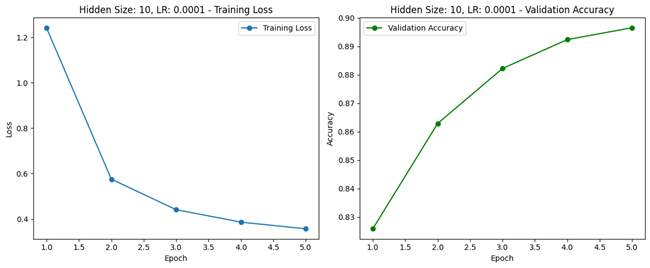 |
| Trial 02 | 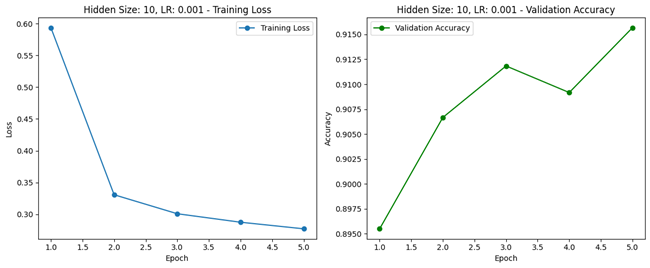 |
| Trial 03 | 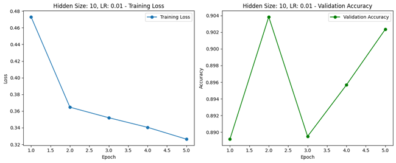 |
| Trial 04 | 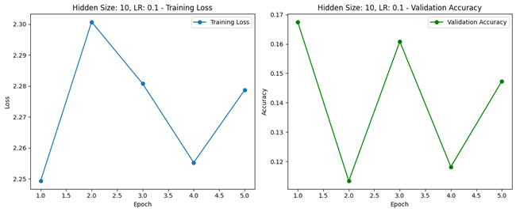 |
| Trial 05 | 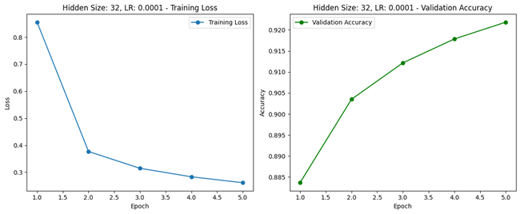 |
| Trial 06 | 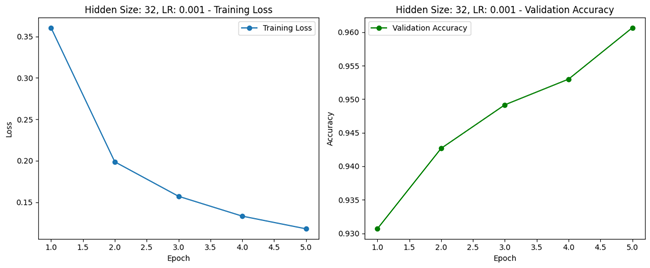 |
| Trial 07 | 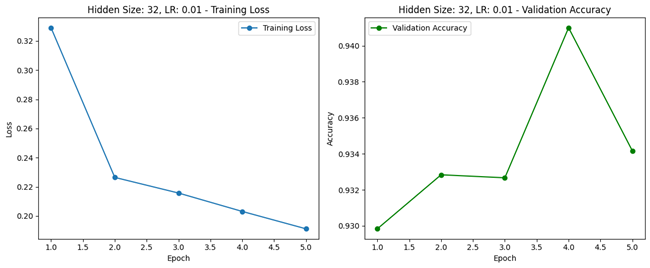 |
| Trial 08 | 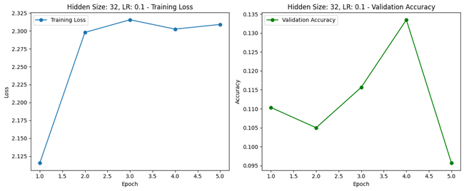 |
| Trial 09 | 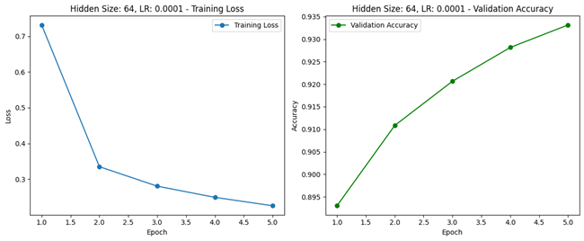 |
| Trial 10 | 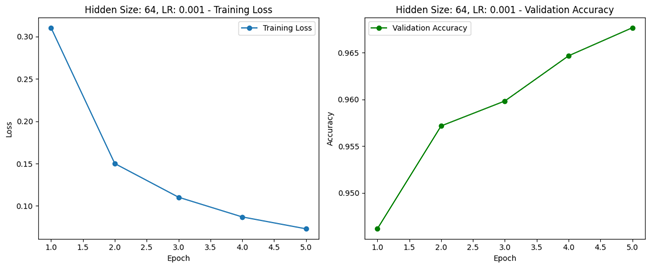 |
| Trial 11 | 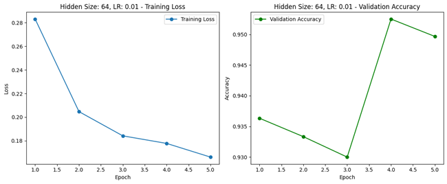 |
| Trial 12 | 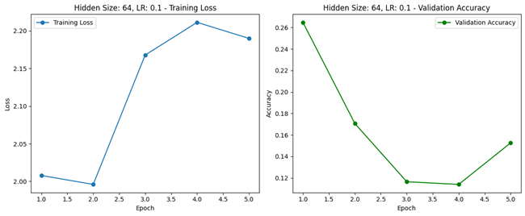 |
| Trial 13 | 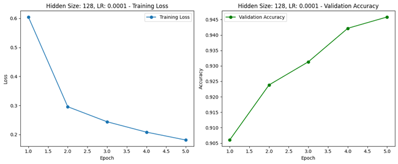 |
| Trial 14 | 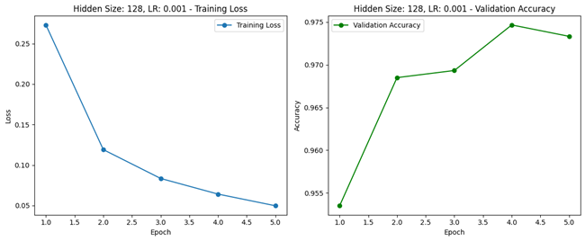 |
| Trial 15 | 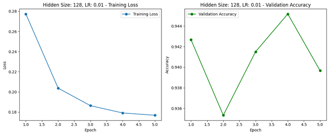 |
| Trial 16 | 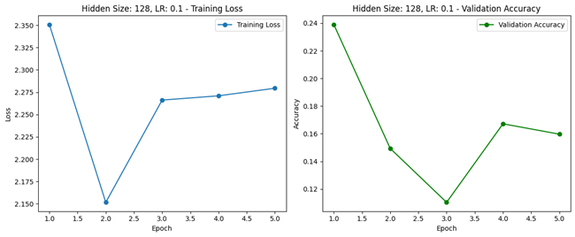 |
| Trial 17 | 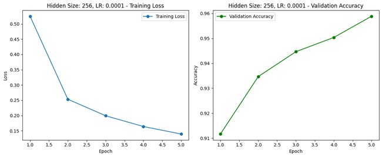 |
| Trial 18 | 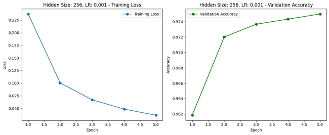 |
| Trial 19 | 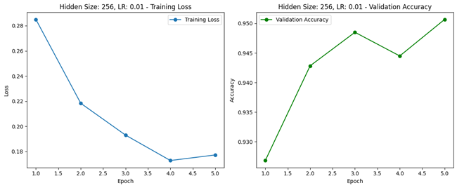 |
| Trial 20 | 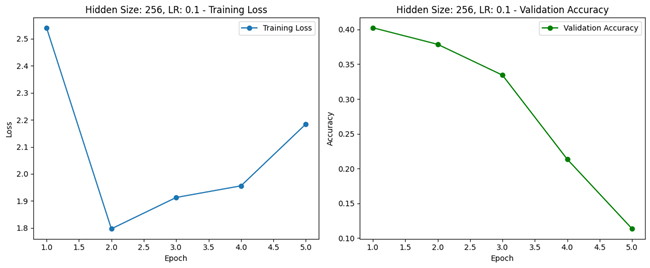 |

## Convolutional Neural Network (CNN)

**Best Hyperparameters:**
- kernel_sizes = [5,5]
- num_layers = 2
- learning_rate = 0.001
- num_epochs = 5

**Test Accuracy:** `0.9911`

**Training and Validation Curves:**

Below are the training and validation loss/accuracy plots for different hyperparameter trials:

| Trial ID | Plot |
|----------|------|
| Trial 01 |  |
| Trial 02 |  |
| Trial 03 |  |
| Trial 04 |  |
| Trial 05 |  |
| Trial 06 |  |
| Trial 07 |  |
| Trial 08 |  |
| Trial 09 |  |
| Trial 10 |  |
| Trial 11 |  |
| Trial 12 |  |
| Trial 13 |  |
| Trial 14 |  |
| Trial 15 |  |
| Trial 16 |  |
| Trial 17 |  |
| Trial 18 |  |
| Trial 19 |  |
| Trial 20 |  |
| Trial 21 |  |
| Trial 22 |  |
| Trial 23 |  |
| Trial 24 |  |
